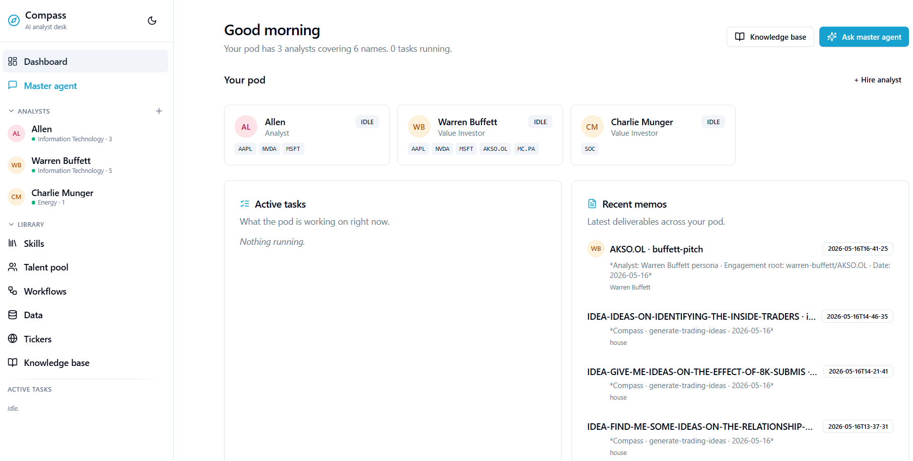
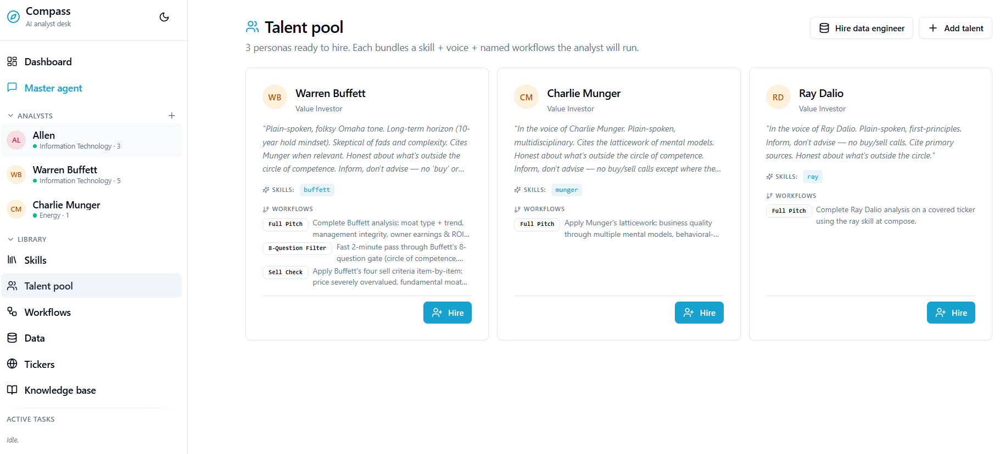
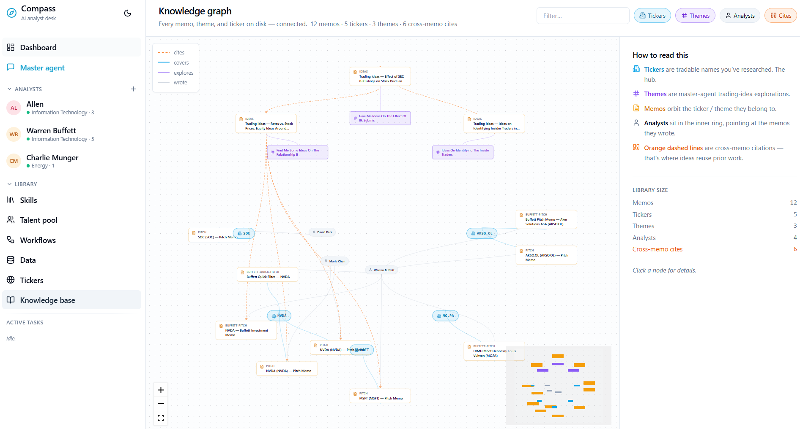
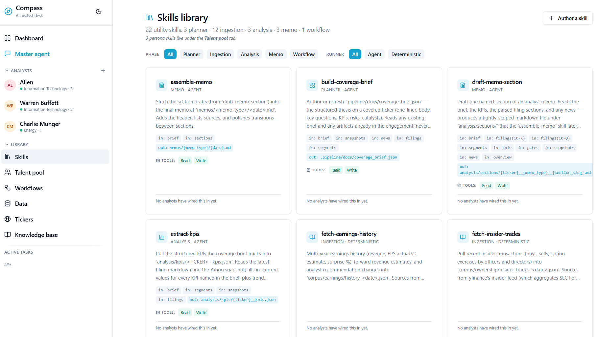
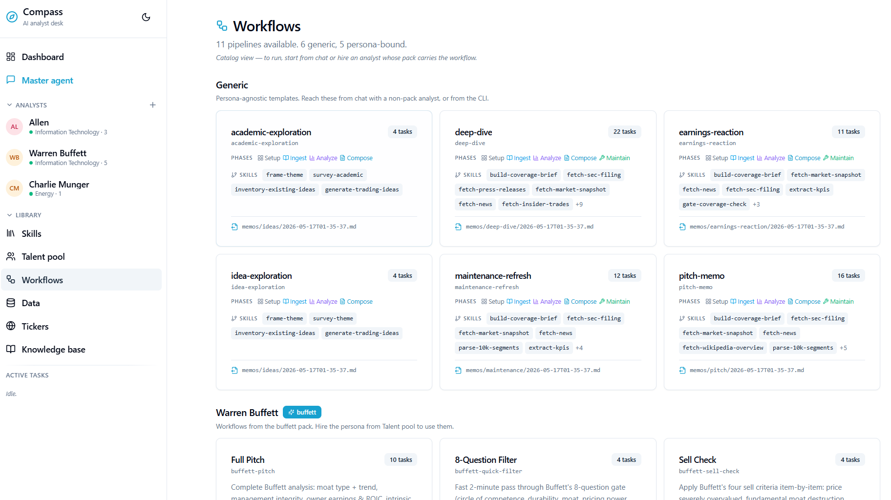
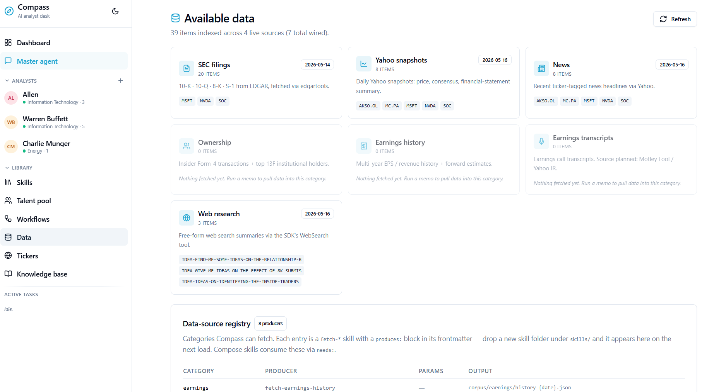

<div align="center">
  <h1>Compass: فريق المحللين بالذكاء الاصطناعي</h1>
  <p><strong>أبحاث بمستوى المحللين بسرعة الذكاء الاصطناعي وتكلفته.</strong></p>
</div>

<p align="center">
<a href="#الترخيص">

</a>
<a href="https://www.python.org/downloads/">

</a>
<a href="https://claude.com/claude-code">

</a>
</p>

<p align="center">
  <a href="./README.md">English</a> | <a href="./README.zh-CN.md">中文</a> | <strong>العربية</strong> | <a href="./README.es.md">Español</a>
</p>

<div dir="rtl">

## جدول المحتويات

- [نظرة عامة](#نظرة-عامة)
- [أبرز الميزات](#أبرز-الميزات)
- [جولة في المنتج](#جولة-في-المنتج)
- [ما الذي تنتجه عملية بحث](#ما-الذي-تنتجه-عملية-بحث)
- [البدء السريع](#البدء-السريع)
- [يوم نموذجي](#يوم-نموذجي)
- [حزم الشخصيات](#حزم-الشخصيات)
- [الترخيص](#الترخيص)
- [الدعم والملاحظات](#الدعم-والملاحظات)

## نظرة عامة

Compass هو ورشة عمل بحثية لمديري المحافظ الاستثمارية. يمكنك **تعيين محللين** — عامين، أو حزم شخصيات مثل وارن بافيت وتشارلي مونغر وراي داليو — وإسناد رموز أسهم إليهم، وطلب الأعمال التي يقوم بها محلل الجانب الشرائي عادةً: مذكرات الترويج، ردود الفعل على الأرباح، تحديثات المتابعة، واستكشافات المواضيع المفتوحة. كل ادعاء مدعوم باستشهاد قابل للنقر يعود إلى مصدر أساسي.

ورشة العمل هي الواجهة — واجهة متصفح تظهر فيها المحادثات وأشجار التغطية والمذكرات والرسم البياني المعرفي الحي جنبًا إلى جنب. كل ما ينتجه المحلل هو ملف نصي على القرص: افتحه في محررك، ابحث فيه بـ grep، تتبّع إصداراته، شاركه. لا توجد قاعدة بيانات مخفية.

</div>

<p align="center">
  
</p>

<div dir="rtl">

## أبرز الميزات

- **🎓 عيّن أي شخص كمحلل** — وظّف من حزم الشخصيات المضمّنة (بافيت، مونغر، داليو)، أو ضمّ عقلًا جديدًا بتقديم كتابات شخصية عامة أو مقابلاتها أو كتاب لنا. كل شخصية مُضمَّنة تصبح محللًا قابلًا للتوظيف بصوته وعدسته الخاصة.
- **⚗️ خط أنابيب التقطير** — أدخل صفحة ويكيبيديا أو مجموعة رسائل مساهمين أو كتاب؛ يخرج مهارة محلل منظَّمة — صوت، نماذج ذهنية، سير عمل افتراضي — جاهزة لتنقيحها قبل وضعها على المكتب.
- **👥 شغّل فريقًا، لا وكيلًا واحدًا** — أنت مدير المحفظة. عيّن محللي أسهم ومديري مخاطر وعلماء بيانات ومهندسي بيانات ومتخصصي قطاعات والمزيد. كل مقعد يحتفظ بقائمة التغطية وسير العمل والصوت الكتابي الخاص به.
- **🧠 الرسم البياني المعرفي كدماغك الثاني** — المذكرات والأسهم والمواضيع والمحللون والاستشهادات معروضة على لوحة واحدة متصلة. شاهد ما كتبه فريقك، إلى أين تعود الادعاءات، وأين الثغرات.
- **💡 بحث الأفكار عبر كل مصدر** — اجمع بين المذكرات السابقة من كل مقعد في الفريق، والأوراق الأكاديمية (arXiv، SSRN، Semantic Scholar)، وتقارير جانب البيع، والمحتوى عبر الإنترنت، والويب. يكشف الوكيل الرئيسي عن الأفكار التي يحتفظ بها الفريق ويبحث عن أفكار جديدة.
- **🛠️ التحكم في سير العمل لكل ناتج** — اضبط سلسلة المهارات وراء كل ناتج: مذكرات الترويج، الموجزات الصباحية، ردود الأرباح، تحديثات المتابعة، استكشافات المواضيع. أضف مهارات جديدة، أعد ترتيب الخطوات، أو ابنِ أنواع مذكرات جديدة كليًا.

## جولة في المنتج

<details>
<summary><strong>🎓 مجموعة المواهب</strong> — شخصيات مُقطَّرة ومحللون مُضمَّنون، جاهزون للتوظيف.</summary>

<p align="center">
  
</p>

</details>

<details open>
<summary><strong>🧠 الدماغ الثاني</strong> — رسم بياني معرفي لكل مذكرة وسهم وموضوع ومحلل واستشهاد أنتجها فريقك.</summary>

<p align="center">
  
</p>

</details>

<details>
<summary><strong>🧰 مكتبة المهارات</strong> — مهارات ذرية يربطها محللوك في سير عمل — أضف الجديد دون كتابة كود.</summary>

<p align="center">
  
</p>

</details>

<details>
<summary><strong>🧭 مكتبة سير العمل</strong> — سير عمل مُعدّ مسبقًا لكل ناتج: مذكرة ترويج، رد على أرباح، موجز صباحي — قابلة للضبط بالكامل.</summary>

<p align="center">
  
</p>

</details>

<details>
<summary><strong>🗄️ مكتبة البيانات</strong> — مصادر بيانات قابلة للتوصيل متاحة لكل مقعد في الفريق.</summary>

<p align="center">
  
</p>

</details>

## ما الذي تنتجه عملية بحث

عندما يعمل محلل على سهم، تُحفظ جميع المخرجات تحت `data/engagements/<analyst>/<TICKER>/`:

| | المخرج | الموقع | الوصف |
|---|---|---|---|
| 📄 | مذكرات | `memos/` | مذكرات ترويج، ردود على أرباح، تحديثات متابعة، كتابات أفكار |
| 📚 | الإيداعات | `corpus/filings/<FORM>/<ACCESSION>/` | 10-K، 10-Q، 8-K — تُجلب كـ Markdown نظيف عبر `edgartools` |
| 📈 | لقطات السوق | `corpus/snapshots/yahoo/` | السعر اليومي، نطاق 52 أسبوعًا، إجماع المحللين، البيانات المالية |
| 📰 | الأخبار والبيانات | `corpus/news/`, `corpus/press/` | الأخبار الحديثة والبيانات الصحفية |
| 🎤 | النصوص | `corpus/transcripts/` | نصوص مكالمات الأرباح عند توفّرها |
| 🔬 | الأبحاث | `corpus/research/` | بحث الويب وملاحظات استقصاء الأدب الأكاديمي |
| 📐 | التحليل | `analysis/kpis/`, `analysis/sections/` | مؤشرات الأداء المستخرجة وأقسام المذكرة المسوّدة |
| 🧾 | موجز التغطية | `.pipeline/docs/coverage_brief.json` | صفحة المحلل الحية حول هذا الاسم |

عمليات البحث الموضوعية (أفكار التداول المفتوحة عبر المحادثة الرئيسية) تُحفظ تحت `house/IDEA-<slug>/` المُركَّب لتجنب تلويث شجرة التغطية الحقيقية.

## البدء السريع

### المتطلبات

- **Python 3.10+**
- اشتراك **[Claude Code](https://claude.com/claude-code)** — يصادق Compass عبر OAuth الخاص بـ Claude Code، لذا لا توجد مفاتيح API منفصلة لإدارتها.
- **لا حاجة لـ Node.js** — واجهة الويب مُسبقة البناء ومُضمَّنة في الحزمة.

### التثبيت

```bash
git clone https://github.com/<your-username>/compass
cd compass
pip install -e .
```

### تسجيل الدخول إلى Claude Code

```bash
npm install -g @anthropic-ai/claude-code
claude /login
```

اتّبع إرشادات OAuth. سيلتقط Compass الاعتماديات تلقائيًا.

### عرّف نفسك لـ SEC EDGAR

تتطلب SEC اسمًا وبريدًا إلكترونيًا في رأس User-Agent لطلبات الإيداعات. انسخ `.env.example` إلى `.env` واضبط:

```env
COMPASS_SEC_USER_NAME=Your Name
COMPASS_SEC_USER_EMAIL=you@example.com
```

### تشغيل ورشة العمل

```bash
compass serve
```

افتح [http://127.0.0.1:8001](http://127.0.0.1:8001) في متصفحك. من هنا يمكنك تعيين المحللين وبناء قائمة المتابعة وتشغيل عمليات البحث دون لمس الطرفية مرة أخرى.

<details>
<summary><strong>تفضّل CLI؟</strong></summary>

بعض الأوامر المفيدة إذا كنت تفضل تشغيل الأمور من الطرفية:

```bash
compass templates                  # سرد سير عمل المذكرات المتاحة
compass plan NVDA pitch-memo       # تخطيط عملية بحث (إنتاج tasks.json)
compass run NVDA pitch-memo        # تخطيط + تنفيذ من البداية إلى النهاية
compass status NVDA                # عرض الموجز وحالة المهام
compass engagements                # سرد عمليات البحث المُحقّقة
compass universe --sector Technology   # تصفح كتالوج الأسهم الأمريكية
```

</details>

## يوم نموذجي

1. **اختر الأسماء.** افتح *My Universe*، ابحث في كتالوج الأسهم الأمريكية، وأضف الأسماء التي تهمك إلى قائمة المتابعة.
2. **عيّن فريقك.** أضف حزمة شخصية (بافيت، مونغر، داليو) أو قطّر شخصية جديدة من صفحة ويكيبيديا. يحصل كل محلل على مكتب وصوت وسير عمل افتراضي.
3. **افتح محادثة.** اطلب من ماريا تشين (أو وارن) "اكتب مذكرة ترويج لـ NVDA". يعرض الشريط الأيمن العمل الجاري — يتم سحب الإيداعات، قراءة الأخبار، صياغة الأقسام.
4. **اقرأ المذكرة.** كل ادعاء استشهاد قابل للنقر يعود إلى الإيداع الأساسي أو النص أو مقالة الأخبار. لا توافق على رأي؟ ردّ في المحادثة وسيعيد المحلل العمل.
5. **عمل الموضوع في المحادثة الرئيسية.** عندما تريد التفكير عبر الكتاب — "أين تعرّضنا إذا أبقى الفيدرالي الأسعار حتى الربع الثالث؟" — تقوم المحادثة الرئيسية بإجراء استقصاء وتجمع مذكرة من قسمين: أي من أفكارك الحالية معرّضة للموضوع، بالإضافة إلى أفكار جديدة للنظر فيها.

## حزم الشخصيات

يأتي Compass بثلاث حزم شخصيات مستثمرين مضمّنة يمكنك تعيينها فورًا:

| | الشخصية | الأسلوب | العدسة المضمّنة |
|---|---|---|---|
| 🟦 | **وارن بافيت** | عقلية المالك، الخندق أولًا، طويلة الأمد | الخنادق الاقتصادية، أرباح المالك، جودة الإدارة |
| 🟧 | **تشارلي مونغر** | شبكة من النماذج الذهنية، الانعكاس | قائمة متعددة التخصصات، "ما الذي يجعل هذه فكرة سيئة؟" |
| 🟪 | **راي داليو** | ماكرو، مدفوع بالمبادئ، واعٍ بالأنماط | الدورات الكبرى، ديناميكيات الديون، تحولات الأنماط |

يمكنك أيضًا تقطير شخصية جديدة من صفحة ويكيبيديا لشخصية عامة — يستخدم Compass مهارة بافيت المضمّنة كقالب للشكل ويطلب من Claude كتابة الباقي. تعامل مع الناتج كنقطة بداية، ثم نقّحه يدويًا.

## الترخيص

[PolyForm Noncommercial 1.0.0](LICENSE). مجاني للاستخدام والتعديل والمشاركة لـ **المشاريع الشخصية والأبحاث والتعليم والأغراض غير التجارية الأخرى**. **الاستخدام التجاري غير مسموح** بدون ترخيص منفصل — تواصل معنا لمناقشة ذلك.

## الدعم والملاحظات

Compass قيد التطوير النشط. سير العمل الأساسي — التعيين، قائمة المتابعة، مذكرة الترويج، رد الأرباح، استكشاف الموضوع — يعمل من البداية إلى النهاية. توقّع بعض الجوانب غير المكتملة، خاصة حول الأسماء غير الأمريكية ومصادر البيانات النادرة.

- 🐛 **وجدت خطأً؟** افتح issue على GitHub.
- 💡 **لديك فكرة أو سير عمل تتمنى وجوده؟** افتح discussion — تشكّل الملاحظات خارطة الطريق.
- 📬 **استفسارات الترخيص التجاري أو الشراكات؟** تواصل عبر معلومات الاتصال بالمستودع.

</div>
