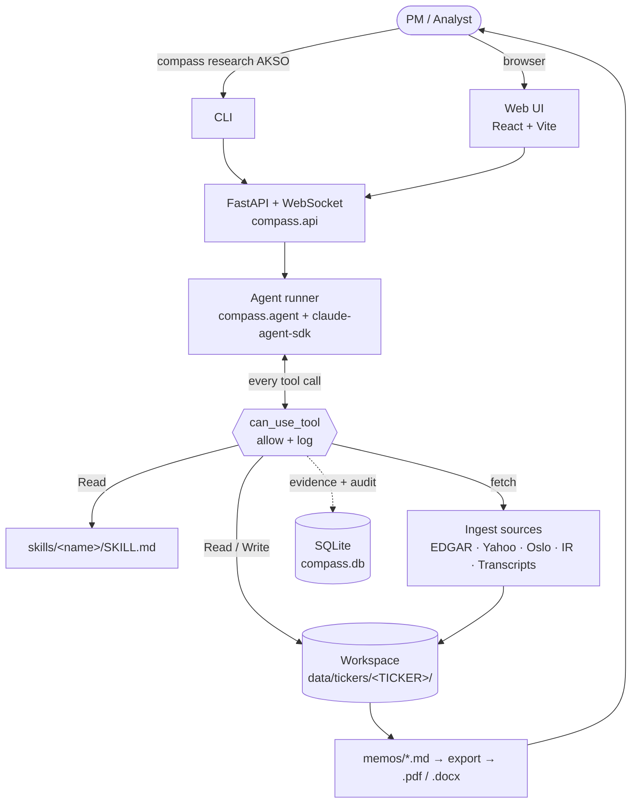

# Compass — Design Notes

> **Status:** Working design as of 2026-05-12. Living document — update as decisions evolve.

Compass is an AI analyst team for portfolio managers. It produces the work an
analyst would: pitch memos, maintenance updates, earnings reactions, and real-time
alerts on covered names — grounded in primary sources, scalable to any number of
tickers, available 24/7.

This document captures the product and architecture decisions made so far so we
don't lose context across sessions.

---

## 1. Origin and positioning

### Origin

This project began as a response to the Mangrove Partners AI Systems Engineer
case study (received 2026-05-11, due 2026-05-18). The case asks for an internal
AI platform that monitors, digests, analyzes, and supports investment research
end-to-end. The deliverable is a Python repo with three reports (ingestion,
adversarial deep research dossier, analyst brief) for two named tickers:

- **AKSO NO** — Aker Solutions, oilfield services, Oslo Stock Exchange
- **SOC US** — Sable Offshore, oil & gas, NYSE / SEC-registered

We're treating the case as a **starting wedge for a real open-source product**,
not just an interview exercise. The case deliverables fall out as a natural
byproduct of the product's V1 features.

### Target user

Primary V1 user is the **portfolio manager who needs analyst output**:

- Solo PMs at family offices
- Emerging managers pre-significant AUM
- Multi-strat PMs needing quick competent takes on names outside their core sector
- Sophisticated retail investors wanting institutional rigor
- Sell-side / independent analysts who serve their own distribution

The product is *designed* for the analyst-to-PM workflow (because it's the most
rigorous form of the work) but accessible to anyone who does fundamental
research and produces grounded memos.

### Value proposition

> *"Your AI analyst team — analyst-grade research at AI speed and cost."*

Existing tools (AlphaSense, Tegus, Bloomberg, FinChat) sell *to* the analyst.
Compass produces the analyst's output and sells *to* the PM. Different P&L line,
different willingness to pay.

### Brand promise

**Every claim is sourced. No exceptions.** Grounding is the product's right
to exist. Every claim in every memo is linked to a specific document, page, and
character span. If a claim can't be grounded, it's flagged `[UNGROUNDED]` —
never inferred silently.

### Positioning language

Replace the analyst *work*, not necessarily the analyst *person*. The healthier
framing is "produce the work product of a junior-to-mid analyst, hire it instead
of or alongside your next analyst." Door stays open at funds that already have
analysts.

---

## 2. Naming

**Locked: Compass.** Decision-support metaphor for the captain (PM); the crew
(AI analysts) is below decks doing the research. Short, easy to understand,
easy to brand, easy to extend beyond finance later.

Working tagline candidates:

- *"Compass — the PM's AI research desk"*
- *"Your AI analyst team. Compass-grade research."*
- *"Decision support for portfolio managers."*

---

## 3. Product surfaces

### V1 (MVP)

| Surface | What it does | Why it matters |
|---|---|---|
| **Morning briefing** | One-page brief across covered names: overnight news, new filings, tone shifts, upcoming events | The daily habit that makes the tool sticky |
| **Memo on demand** | "Give me a pitch on $TICKER" → full agent pipeline → polished memo with citations | Core analyst output |
| **Pipeline view** | Live task list per ticker (pending / in-progress / done / failed / blocked / skipped); cross-ticker progress bars on the Coverage Dashboard | Transparency + trust — the PM watches the agent work, not a black-box spinner. Pairs with the evidence ledger for full audit |
| **PM interrogation** | PM asks follow-up questions of a memo; agent answers from the corpus with citations | The "morning meeting" experience |
| **Evidence ledger** | Every claim links to source span; clickable in UI | The visible proof of grounding |
| **Memo export** | View in UI + export to PDF/markdown for forwarding | PMs forward memos to PMs / LPs / risk |

### V2 (later)

- **Proactive push** — agent watches the universe, generates unsolicited memos when material events occur (the "passive monitoring of parked ideas" feature from the case study)
- **Opposing views** — bull memo and bear memo on the same name, side by side
- **Comparables** — given Company A, generate comparative analysis across peers
- **Filing diff alerts** — year-over-year material changes in 10-K risk factors and MD&A

### Out of scope (deliberately not building)

- Quant backtester (crowded space, off-brand)
- Stock screening (commodity)
- Sentiment / social scraping (low signal)
- Idea generation from sectors (high-risk, low-quality)

---

## 4. Business model

**Free / open-source for now.** OSS gets stars from devs and solo investors;
adoption breeds future monetization options.

Long-term path is the standard open-core pattern (PostHog, Sentry, Cal.com):

- **OSS engine** — self-host the agent, ingest, skills, ledger, watchlist. Free forever.
- **Hosted version (later, paid)** — managed cron, managed corpus refresh, premium data integrations, team features, audit-ready ledger.
- **Enterprise (later, paid)** — white-label, VPC deployment, house-style memo templates.

Not pursuing monetization decisions in this design pass.

---

## 5. Architecture decisions

### Stack

- **Backend:** Python. FastAPI for HTTP + WebSocket. `claude-agent-sdk` (Python) for the agent loop.
- **Frontend:** React + Vite + Tailwind. WebSocket connection to backend.
- **Storage:** SQLite (file-based) for evidence ledger, audit log, sessions. JSON-on-disk for pipeline state.
- **No vector DB, no Redis, no Docker, no workflow engine.** Lean by design.

### Provider

**Anthropic Claude only.** Single provider for V1. Architecture leaves a seam
for additional providers later (5-function adapter contract from Dr. Claw)
but does not implement any.

### Authentication

Two modes, auto-detected:

1. **OAuth via Claude Code subscription** (primary, for dev and personal use) — log in once with `claude login`, SDK uses subscription credits.
2. **API key** (`ANTHROPIC_API_KEY` env var) — fallback for reviewers or production use without a personal subscription.

API key wins if both are present. README documents both paths.

### Patterns reused from Dr. Claw

Reference notes live in `background/code_analysis_want_to_use/`. The patterns
to port:

- **Markdown-as-prompt skills.** Each skill is a folder with `SKILL.md` + references. Agent reads on demand. Token-efficient, lazy-loaded, composable.
- **JSON pipeline state.** `company_dossier.json` (the plan), `research_tasks.json` (the steps). State on disk. No workflow engine.
- **`PreToolUse` hook for observability; `can_use_tool` for policy.** The `PreToolUse` hook fires on every tool call regardless of permission state — this is where evidence-ledger rows get written. `can_use_tool` is the SDK's replacement for the interactive permission prompt and only fires for tool calls that aren't pre-allowed; we reserve it for policy decisions on ambiguous calls in later slices.
- **CLAUDE.md system-prompt template.** Per-company template that sets the agent's role (analyst), house style, citation rules.
- **For-loop auto-runner.** Sequential task execution. JSON file is source of truth.
- **WebSocket streaming.** Agent output streams to UI as produced. The same channel carries task-state events emitted by the auto-research runner — when a task flips `pending → in-progress → done`, the Pipeline view updates live without polling. This is what makes the agent's work visible to the PM instead of opaque.
- **5-function adapter contract.** One provider for now; seam is preserved for future providers.

Patterns dropped from Dr. Claw:

- Multi-provider implementation (Codex, Gemini, Cursor) — provider seam only
- Electron wrapper
- node-pty / xterm shells
- News feed UI
- MCP marketplace UI

### Grounding as a first-class object

The evidence ledger is a SQLite table (Slice 4, see note below for current shape):

```
evidence(
  id, doc_id, ticker, source, source_url, form_type, retrieved_at,
  local_path, page, char_span_start, char_span_end,
  line_start, line_end, text_hash, content
)
```

Every fetched chunk gets a row at fetch time. Every claim in generated memos
must cite a ledger row by ID (Slice 6+). The `PreToolUse` hook writes a row
to the companion `audit` table on every Read / WebFetch. A post-generation
validator strips any claim missing citations and replaces with `[UNGROUNDED]`.

### Data strategy

**Public sources only.** No paid data feeds in V1.

| Source | Use | Library / approach |
|---|---|---|
| SEC EDGAR | 10-K, 10-Q, 8-K, S-1, DEF 14A, Form 4 | `sec-edgar-downloader` or direct REST API |
| Yahoo Finance | Price history, basic financials, analyst targets | `yfinance` |
| Oslo Børs NewsWeb | Stock exchange filings for Oslo-listed names | scraper |
| Company IR pages | Annual reports, quarterly reports, press releases | scraper |
| Earnings call transcripts | Where freely available | Motley Fool, Yahoo Finance, company IR pages |
| Google News / GDELT | Sentiment-light news scan | RSS / public API |

Each source is a Python module in `compass/ingest/` with a shared interface
`fetch(ticker) → list[Document]`. Adding a source is a new module; adding a
ticker is config.

---

## 6. Repo layout

### Design principles

The structure optimizes for four things:

- **Discoverability.** A new contributor lands on the repo and finds the right file in 30 seconds. Flatter beats hierarchical until it actually hurts.
- **Python-idiomatic.** One main package with submodules. Single files stay single files; packages only when there are multiple implementations.
- **CLI as a first-class entry point.** `pip install compass-research && compass research AKSO` works on day one. The web UI is the second surface, not the only one.
- **Two-layer split.** Source-controlled code in the repo; runtime per-ticker data in `data/tickers/<TICKER>/`. The two layers never get confused.

### Repo structure

```
compass/
├── README.md                       # OSS front door
├── LICENSE
├── pyproject.toml
├── package.json                    # frontend only
├── .env.example
├── .gitignore
│
├── compass/                        # the Python package (one canonical home)
│   ├── __init__.py
│   ├── cli.py                      # `compass research AKSO`, `compass watch add SOC`
│   ├── api.py                      # FastAPI app + WebSocket
│   ├── agent.py                    # claude-agent-sdk wrapper, can_use_tool
│   ├── config.py                   # env, constants, model IDs
│   ├── workspace.py                # workspace lifecycle, paths, skill symlinks
│   ├── pipeline.py                 # dossier + tasks schemas
│   ├── db.py                       # SQLite: evidence ledger + audit + sessions
│   ├── export.py                   # memo → PDF / DOCX (uses Anthropic skills)
│   ├── ingest/                     # data sources, pluggable
│   │   ├── __init__.py
│   │   ├── base.py                 # Document, Source ABC
│   │   ├── edgar.py
│   │   ├── yahoo.py
│   │   ├── oslo_newsweb.py
│   │   ├── ir_scraper.py
│   │   └── transcripts.py
│   ├── routers/                    # FastAPI routers
│   │   ├── tickers.py
│   │   ├── memos.py
│   │   ├── skills.py
│   │   └── evidence.py
│   └── templates/                  # starter materials copied into each workspace
│       ├── CLAUDE.md
│       └── workspace.json
│
├── skills/                         # markdown business logic, top-level on purpose
│   ├── research-planner/SKILL.md
│   ├── ingest-and-triage/SKILL.md
│   ├── missing-context-report/SKILL.md
│   ├── extract-tone-shifts/SKILL.md
│   ├── find-contradictions/SKILL.md
│   ├── pitch-memo/SKILL.md
│   ├── maintenance-update/SKILL.md
│   ├── earnings-reaction/SKILL.md
│   ├── pm-interrogation/SKILL.md
│   ├── analyst-brief/SKILL.md
│   └── morning-brief/SKILL.md
│
├── web/                            # React frontend
│   ├── index.html
│   ├── vite.config.js
│   ├── tailwind.config.js
│   └── src/
│       ├── main.jsx
│       ├── App.jsx
│       ├── components/
│       ├── hooks/
│       └── lib/
│
├── tests/
│   ├── compass/                    # backend unit tests
│   └── skills/                     # skill eval suite — the grounding-promise enforcer
│       └── fixtures/
│
├── examples/                       # OSS adoption helpers
│   ├── quickstart.ipynb            # "research a ticker in 5 lines"
│   ├── writing-a-skill.md          # how to extend Compass
│   └── sample-memo.md              # what the output actually looks like
│
├── data/                           # gitignored runtime data
│   ├── compass.db                  # SQLite, one file, all tables
│   └── tickers/                    # per-ticker workspaces, materialized lazily
│
├── docs/
│   ├── design/README.md            # the living design doc
│   ├── architecture.md
│   ├── scaling.md
│   └── runbook.md
│
└── background/                     # case study + reference notes
```

### Per-ticker workspace structure

When a ticker is added, the server materializes a workspace under
`data/tickers/<TICKER>/`. Everything inside is agent-managed; `.claude/` is
the only hidden directory and follows the SDK's convention.

```
data/tickers/SOC_US/
├── workspace.json                  # paths, status, last-updated
├── dossier.json                    # generated plan: thesis, key questions
├── tasks.json                      # generated task list
├── corpus/                         # the evidence base
│   ├── filings/                    # SEC filings (edgartools-fetched, see Slice 2.5)
│   │   └── <FORM>/<ACC>/           # primary.md (clean Markdown) + metadata.json
│   ├── transcripts/                # earnings calls
│   ├── press_releases/
│   ├── news/
│   └── manifest.json               # what was ingested when, with hashes
├── memos/                          # versioned outputs — the artifacts the PM gets
│   ├── pitch/2026-05-12.md         # + .pdf alongside after export
│   ├── maintenance/
│   ├── earnings/
│   └── briefings/
├── qa/                             # PM interrogation transcripts
│   └── 2026-05-12.md
└── .claude/                        # the only hidden dir — agent-facing
    ├── CLAUDE.md                   # ticker-aware system prompt
    └── skills/                     # symlinks → ../../../../skills/*
```

**Memos as versioned files, not DB rows.** PMs forward memos. The audit trail of "what did the agent say on May 12 vs. August 15" is just `ls memos/pitch/`. The DB only holds the evidence ledger and audit log; the memos themselves are derived file artifacts.

**Slice 2.5 note — edgartools replaces `sec-edgar-downloader` + custom HTML cleaner.** Real-world testing of `compass summarize` on a 1.9 MB primary-document.html exposed that EDGAR HTML is structurally hostile to the Read tool (very long inline-styled lines, an XBRL `display:none` preamble of ~1000+ lines of namespace gibberish, no breakable whitespace near the document start). A custom BeautifulSoup pre-processor (Slice 3.5) partially fixed this. We then ripped both `sec-edgar-downloader` and the custom cleaner out in favor of [edgartools](https://github.com/dgunning/edgartools) — the Anthropic-blessed Python library that handles fetching, XBRL parsing, and Markdown conversion in one place. Net result:

- `EdgarSource.fetch()` now writes `data/tickers/<TICKER>_<EXCH>/corpus/filings/<FORM>/<ACCESSION>/primary.md` (clean Markdown — `###` headings, `|...|` tables) + `metadata.json` alongside.
- Slice 2's CLI surface is unchanged (`compass fetch SOC 10-K`).
- The `skills/parse-edgar-filing/` skill folder was retired — `edgartools` makes the HTML preprocessing step unnecessary at this layer.
- Structured section accessors (`tenk.business`, `tenk.risk_factors`, `tenk.management_discussion`, `tenk.financials`) are now available to later slices (skill catalogue, evidence-ledger chunking, pitch-memo composition).

**Slice 3 note — PreToolUse over can_use_tool, HTML-first reading.** Two findings from wiring the agent up to read a document:

1. The build-plan slice originally named `can_use_tool` as the auto-logger for the evidence ledger, but the SDK only invokes `can_use_tool` for tool calls that would otherwise prompt the user — pre-allowed tools bypass it entirely. The correct observability primitive is a `PreToolUse` hook, which fires on every tool call regardless of permission state. The architecture decisions section above has been corrected.
2. The slice also originally mentioned Anthropic's `pdf` skill, but SEC primary documents (10-K, 10-Q, 8-K) are HTML. We deferred the PDF skill to when we add a source that actually emits PDFs (likely the IR scraper in Slice 7+). The agent reads HTML directly via the Read tool.

**Slice 3.5 note (superseded by Slice 2.5).** A first attempt at the HTML preprocessing problem introduced a `skills/parse-edgar-filing/` folder (`SKILL.md` + `scripts/extract_text.py` using BeautifulSoup) to strip raw EDGAR HTML before the agent read it. This shipped briefly but was retired the same day in favor of adopting `edgartools` wholesale (see Slice 2.5 above) — the upstream library already emits clean Markdown, so the custom skill became dead weight. The retired pattern is preserved here for historical context: `compass.agent.summarize()` shelled out to the script via `subprocess`, `add_dirs` granted Read access, and `max_turns=20` bounded the loop. The architectural lesson worth keeping: **published Claude SEC skills assume input is already clean text — the cleaning happens upstream of the skill layer**, in an MCP server / Python library / paid data provider. Compass now relies on `edgartools` for that cleaning step.

**Slice 4 note — SQLite evidence ledger and audit log shipped.** Two tables in a single `data/compass.db`:

- **`evidence`** — every chunk of every fetched doc. Populated by `EdgarSource.fetch()` after writing `primary.md`. Schema: `id, doc_id, ticker, source, source_url, form_type, retrieved_at, local_path, page (NULL for Markdown), char_span_start, char_span_end, line_start, line_end, text_hash, content`. `UNIQUE(doc_id, char_span_start, char_span_end)` makes re-fetch idempotent.
- **`audit`** — every tool call the agent makes. Populated by the `PreToolUse` hook (which still streams progress to stderr — that wasn't replaced, both happen now). Read-tool's `file_path`/`offset`/`limit` are extracted into typed columns so future queries can join against `evidence`. Full `tool_input` is preserved as JSON so non-Read tools don't lose information.

**Chunking strategy:** 100-line fixed chunks (~50 rows per 10-K). The `text_hash` (sha256) supports content-equality checks and dedup across re-fetches. `line_start`/`line_end` are added beyond the originally-sketched `char_span_*` because the agent reads via line offsets (Read tool's `offset` and `limit`) — keeping both byte spans and line ranges lets later joins go either direction without an extra lookup.

**CLI surface:** `compass evidence list <TICKER>` lists recent chunks (id, form, line range, hash); `compass evidence show <ID>` prints one chunk's content; `compass evidence audit` lists recent tool calls. Audit-DB failures inside the hook are caught and logged — they can never break the agent loop.

**Deferred to later slices:** session/run modeling (link audit rows to a single `compass summarize` invocation), citation validation (separate `citation-audit` skill), full-text search via FTS5 (only when the catalogue is large enough to need it).

**Slice 5 + 6 note (compressed) — first skill + first end-to-end memo.** Slice 5 in the original plan was "stand up the skills infrastructure" as a separate slice from "ship the first memo." We collapsed them: building infrastructure-in-the-abstract was plumbing, not product, and the agent-reads-a-SKILL.md pattern turns out to be light enough to bundle. What landed:

- **`skills/pitch-memo/SKILL.md`** — the first production skill. Frontmatter (`name`, `description`, `allowed-tools: Read Write`) plus a structured body covering when-to-use, non-negotiables (every claim cited, no recommendations, no ungrounded inference), required memo structure (Thesis / Business / Recent Financials / Risks / Catalysts / Sources), citation rules, and common failure modes. The shape mirrors Anthropic's [equity-research plugin](https://github.com/anthropics/financial-services/blob/main/plugins/vertical-plugins/equity-research) so future skills slot into a recognizable format.
- **`compass research <TICKER> --type pitch`** — new CLI command. `compass.agent.research()` builds a prompt that includes the full `SKILL.md` content + a compact `ev#N → line range` citation table (derived from `evidence`) + paths to all fetched filings + the exact output path. Tools enabled: `Read` (for filings) and `Write` (for the memo). `max_turns=40` budget (40 turns = 1 read-cycle + ~5–15 actual reads + planning + the Write).
- **Citation mechanism (lite).** Instead of standing up an MCP server or a custom tool, the agent gets the citation table inline in the prompt. Each Read returns lines; the agent looks up `ev#N` for any cited fact. Verified post-hoc: every `[ev#N]` in the SOC pitch memo points at an evidence-row id that the agent's audit log shows it actually read.
- **Memo lives on disk, not in the DB.** `data/tickers/<TICKER>/memos/<type>/<YYYY-MM-DD>.md` is the artifact. The DB is the audit trail; the file is the deliverable. PMs forward files.

**What this slice deliberately is not:**

- *Agent-autonomous skill discovery.* The skill is loaded by `research()` via filename convention (`{memo_type}-memo/SKILL.md`), not by the agent reading `.claude/skills/` on its own and matching frontmatter descriptions. That's a later slice when the catalogue is big enough to justify the loader complexity.
- *Citation validation.* We don't yet verify that the chunk an `[ev#N]` cites actually contains the claimed fact. A `citation-audit` skill would post-process memos and strip ungrounded claims; tracked for a later slice.
- *Multi-source corpus.* The pitch memo currently reads only EDGAR filings (10-K minimum, future 10-Q / 8-K when present). Yahoo prices, Oslo Børs filings, IR press releases, and earnings transcripts arrive in Slices 7+.

**Verified end-to-end on 2026-05-12:** `compass research SOC --type pitch` ran in ~4.5 minutes and produced [a full pitch memo](../../data/tickers/SOC_US/memos/pitch/) on Sable Offshore — Thesis, Business, Recent Financials, Risks, Catalysts — with 8+ distinct `[ev#N]` citations spanning the business overview, the pipeline litigation, the $922 M debt maturity wall, the OS&T capital plan, the criminal complaint, and the going-concern qualification. This is the first artifact the project can show a PM.

### System architecture



Key flows the diagram captures:

- Two entry points (CLI, Web UI) converge on the same FastAPI backend.
- The agent runs the Claude SDK loop in-process.
- Every tool call passes through `can_use_tool`, which both allows it and writes to the evidence ledger.
- Tools include reading skill playbooks, reading / writing the workspace, and fetching from ingest sources.
- All activity is auditable via SQLite.
- Memos are the final artifact returned to the PM, exportable to PDF / DOCX.

---

## 7. Build plan

We build **vertically, not horizontally.** Each slice is the smallest unit with
a tangible, testable, observable outcome — and each one exercises the layers
beneath it so architectural mismatches surface immediately, not at integration
time. After every slice, the project is demoable.

### Slice sequence

| # | Slice | "Done" looks like | What it validates |
|---|---|---|---|
| 1 | **Hello, agent** | `compass ask "What is 2+2?"` returns "4" from terminal | Python package installs, CLI entry point, OAuth auth, claude-agent-sdk loop |
| 2 | **Ingest one document** | `compass fetch SOC 10-K` writes the latest SOC 10-K to `data/tickers/SOC_US/corpus/filings/` | EDGAR connection, Document schema, workspace materialization, file-on-disk layout |
| 3 | **Agent reads a document** | `compass summarize SOC <path>` produces a one-paragraph summary referencing the document | Tools wiring, Anthropic `pdf` skill integration, `can_use_tool` gate fires |
| 4 | **Evidence ledger** | After slice 3, `compass evidence list SOC` shows the doc was read with span info | SQLite schema, `can_use_tool` auto-logs, audit surface |
| 5 | **First production skill** | `compass run-skill ingest-and-triage SOC` produces a triage report using only the skill's instructions | Skills-as-markdown pattern, agent reads `SKILL.md` and follows it |
| 6 | **First memo end-to-end** | `compass research SOC --type pitch` produces a memo with citations in `data/tickers/SOC_US/memos/pitch/` | `research-planner` + `pitch-memo` skills chained, tasks.json runner. **Mangrove deliverable becomes achievable here.** |

After slice 6 we have a real end-to-end CLI product. Subsequent slices:

- **Slices 7–9 — breadth on the spine.** More ingestion sources (Yahoo, Oslo NewsWeb, IR scraper, transcripts) and more memo types (earnings reaction, maintenance update, analyst brief, morning brief).
- **Slices 10–12 — web UI.** Coverage Dashboard, Pipeline view, Memo viewer with clickable evidence ledger. The CLI continues to work; the UI is a window onto the same machinery.
- **Slices 13+ — V2 surfaces.** Proactive push (passive monitoring of parked ideas), opposing views, comparables, filing diff alerts.

### Ordering rationale

- **Slice 1 first** because OAuth-via-Claude-Code for the Python SDK is the riskiest unknown. If it doesn't work as expected, we discover it before anything depends on it.
- **Slices 2–4 form the data spine** (ingest → tool → ledger). Without these, no memo can be grounded — and grounding is the brand promise.
- **Skills (5+) come after the data spine** because skills *use* the ingest / tool / ledger layers. Writing skills first would mean writing against mocks and discovering mismatches later.
- **Memo (6) before more ingestion sources** because a second 10-K source teaches us nothing new architecturally; the first end-to-end memo teaches us a lot.
- **UI is deliberately last on the spine.** The CLI is the primary product surface for OSS adoption; the UI is a window onto the same machinery and can be deferred without blocking value delivery.

### Shipping discipline

Each slice ends with:

- A passing smoke test that exercises the new capability end-to-end (lives in `tests/`)
- A short README update so a fresh contributor can reproduce
- A version bump or git tag so progress is externally visible
- An honest note in this design doc if the slice exposed any architectural surprises

Slice 1 starts when the design doc is locked.

---

## 8. Open questions / next threads to design

Not yet decided. Roughly in order of what to pull next:

- **Skill catalogue.** Which skills to write first, in what order, with what dependencies.
- **Memo templates.** What the pitch memo / earnings reaction / maintenance update look like in detail. Schema, sections, length, house style.
- **Mangrove deliverable mapping.** How the three case-study reports (ingestion, dossier, brief) sit on top of the V1 product surfaces. Which V1 skills generate them.
- **Watchlist data model.** How tickers, coverage stages, last-update timestamps, and pending events are stored.
- **Interrogation history.** Whether PM Q&A is per-session or persistent, how it links to memos.
- **Frontend UX details.** Coverage dashboard layout, evidence-ledger interaction patterns, "click claim → see source" mechanics.
- **Onboarding flow.** How a new user adds their first ticker, what happens before the first morning brief is ready.

---

## 9. Reference materials

- Mangrove case study: `background/AI Systems Engineer Case Study.pdf`
- Original email: `background/request.txt`
- Dr. Claw architecture notes (reference): `background/code_analysis_want_to_use/`

Deadline for Mangrove deliverable: **Monday, May 18, 2026**.
